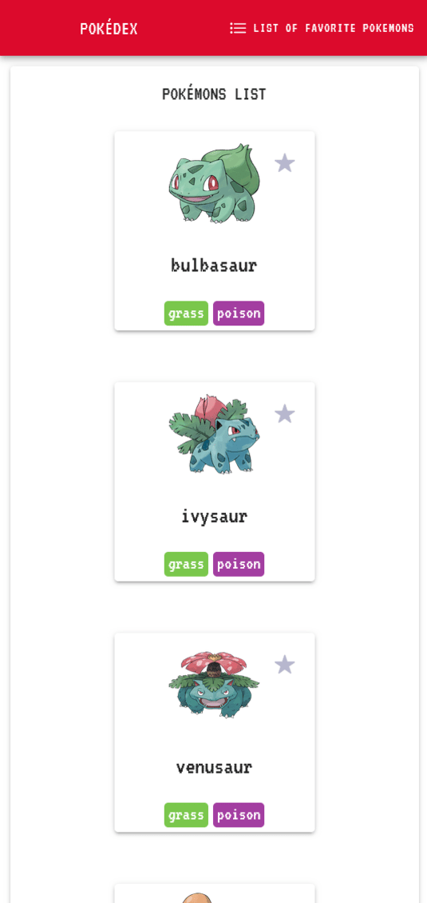
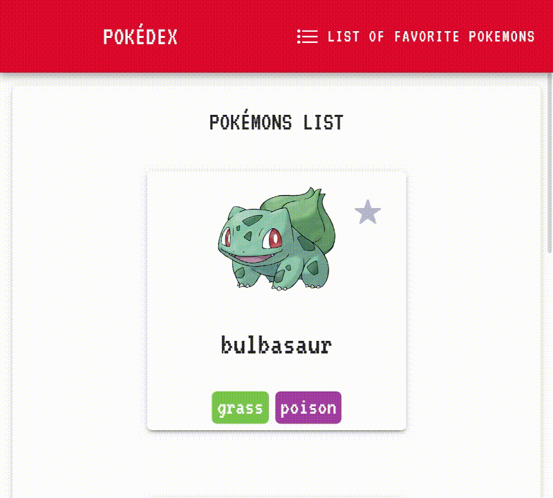
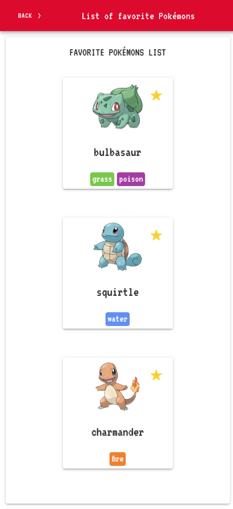
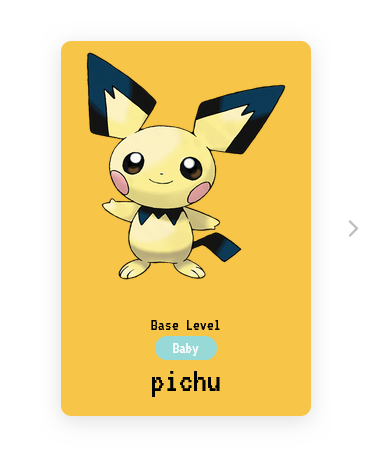
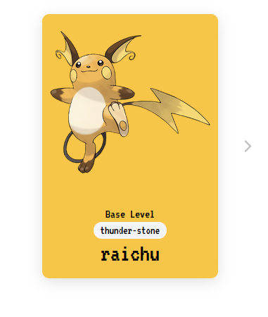
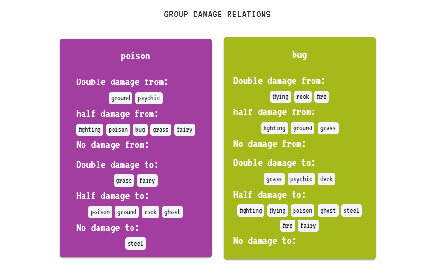
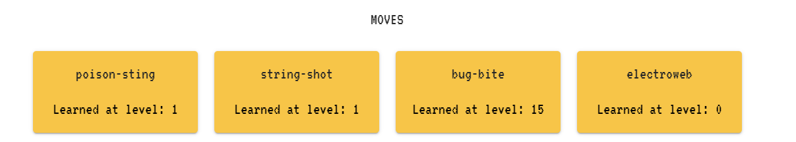

<h1 align="center">Pokémon App</h1>

 [Descrição do Projeto](#descrição-do-projeto)•
 [Pré-requisitos](#pré-requisitos) • 
 [Instalação](#instalação) • 
 [Construído com](#construído-com) • 
 [Funcionalidades](#funcionalidades) • 

## Descrição do projeto

O Pokedex app é um projeto feito em Ionic Framework com Angular para que você possa ver todos os Pokémons, salvar alguns como favoritos em sua própria lista e ver detalhes de cada um como:
- Status das características do Pokémon
- Imagem padrão e imagem do Pokémon Shiny
- Evoluções
- Golpes
- Forças e fraquezas dos tipos do Pokémon

## Pré-requisitos

1 - [Git](https://git-scm.com/download/win) é necessário, clique no link para fazer o download.

2 - [Node.js](https://nodejs.org/en) é necessário, clique no link para fazer o download.

3 - IDE de sua preferência, o projeto foi desenvolvido utilizando [VS Code](https://code.visualstudio.com/download)

4 - Após instalar o Git e o Node.js, instale o Angular Cli

    npm install -g @angular/cli

## Instalação

Após os pré-requisitos estarem instalados siga os passos a seguir:

1 -
Faça o clone do repositório no seu computador.

    https://github.com/EduardoLimaCastro/pokedex.git 

2 - 
Acesse a pasta do projeto no terminal/cmd
    
    cd pokedex

3 - Instale as dependências

    npm install 

4 - Inicie o projeto

    ionic serve 

## Construído com

- **[Ionic Framework](https://ionicframework.com/)**
- **[Angular](https://angular.dev/)**
- **[Axios](https://axios-http.com/docs/intro)**
- **[Howler](https://howlerjs.com/)**

## Funcionalidades

#### Favoritar seus Pokémons
Com o aplicativo, você pode adicionar os Pokémons que mais gosta a sua lista de favoritos clicando no ícone de estrela na parte superior direta do card do Pokémon.

#### Lista de favoritos

Ao clicar na lista de Pokémons favoritos, aparecerão somente os Pokémons marcados na sua tela.

#### Detalhes do Pokémon

Ao clicar no card do Pokémon, a página de detalhes será aberta. Nela é possível favoritar o Pokémon ao clicar na estrela no canto superior direito, e reproduzir o som do Pokémom ao clicar o botão 'Cry' ao lado de sua imagem. Também pode-se verificar suas imagens 'Shiny' e 'Default', além de detalhes de habilidades e uma frase que dá as características de cada Pokémon.

#### Linha de evolução 

Na aba de evolução são apresentados todos os Pokémons da linha de evolução e com alguns detalhes como se é um Pokémon bebê ou se precisa de algum item para evolução como 'thunder-stone'.

#### Detalhes dos grupos do Pokémon
Nessa aba são mostrados dados relacionados com o grupo do Pokémon como:

- Causa duplo dano à:
- Causa meio Dano à:
- Não causa dano à:
- Recebe duplo dano de:
- Recebe meio Dano de:
- Não recebe dano de:

#### Moves
Nessa aba são apresentados alguns golpes do Pokémon selecionado:

